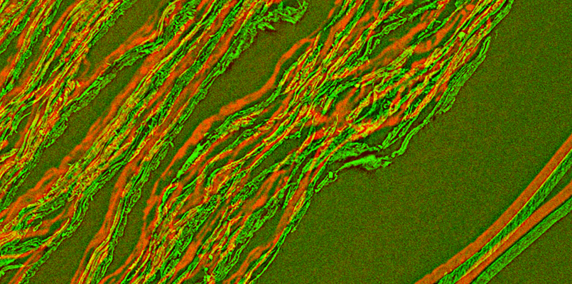

# Vesuvius Scroll Alignment
Utilities for aligning scroll volumes for the Vesuvius Challenge.
</br></br>
Please start by reading the [report.](https://paul-g2.github.io/VesuviusScrollAlignment/report.pdf)
</br></br>

</br></br></br>
## How to use the Scroll Align program

This program assumes you have a local copy of the scroll files, with a directory layout that matches the one at dl.ash2txt.org.

At the command line, run `python scroll_align.py`, with the following arguments:
```
 -v or --volpkg_dir   The volpkg directory. Example: C:/PHerc1667.volpkg
 -s or --source_vol   The name of the source volume. Example: 20231107190228
 -t or --target_vol   The name of the target volume. Example: 20231117161658
 -n or --slicenums    The list of slice numbers to use for alignment. Example: 2000 4000 6000 8000 10000
 -d or --downsamps    (Optional) A decreasing sequence of down-sampling factors (often useful when the
                      initial alignment is poor). Example: 4 2 1
-sb or --source_blur  (Optional) A gaussian-blur sigma value to apply to the source volume. Example: 2.5
-tb or --target_blur  (Optional) A gaussian-blur sigma value to apply to the target volume. Example: 2.5
-xr or --xfrm_ranges  (Optional) Ranges for each of the 12 parameters of the affine transformation matrix,
                      in row-major order. If not supplied, sensible default ranges will be used. 
-xf or --initial_xfrm (Optional) The 16 parameters of the initial affine transformation matrix, in
                      row-major order. If not supplied, the program will try to read the initial transform
                      from the appropriate json file in the volpkg/transforms directory.
```
<br><br>
## How to use the Check Alignment program

At the command line, run `python check_alignment.py`, with the following arguments:
```
-sd or --source_dir     The directory containing the source volume.
-td or --target_dir     The directory containing the target volume.
-bx or --before_xfrm    The json file containing the "before" transform.
-ax or --after_xfrm     The json file containing the "after" transform.
-sn or --slice_num      The slice number to check. 
-sc or --slice_corners  (Takes precedence over slice_num.) Instead of a slice number, 9 numbers specifying
                        the (x, y, z) coordinates of upper-left, upper-right, and lower-left corners of the 
                        desired alignment image may be provided. 
-o  or --out_file       The path where the output image should be written.
```
